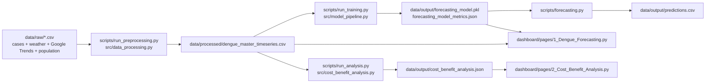
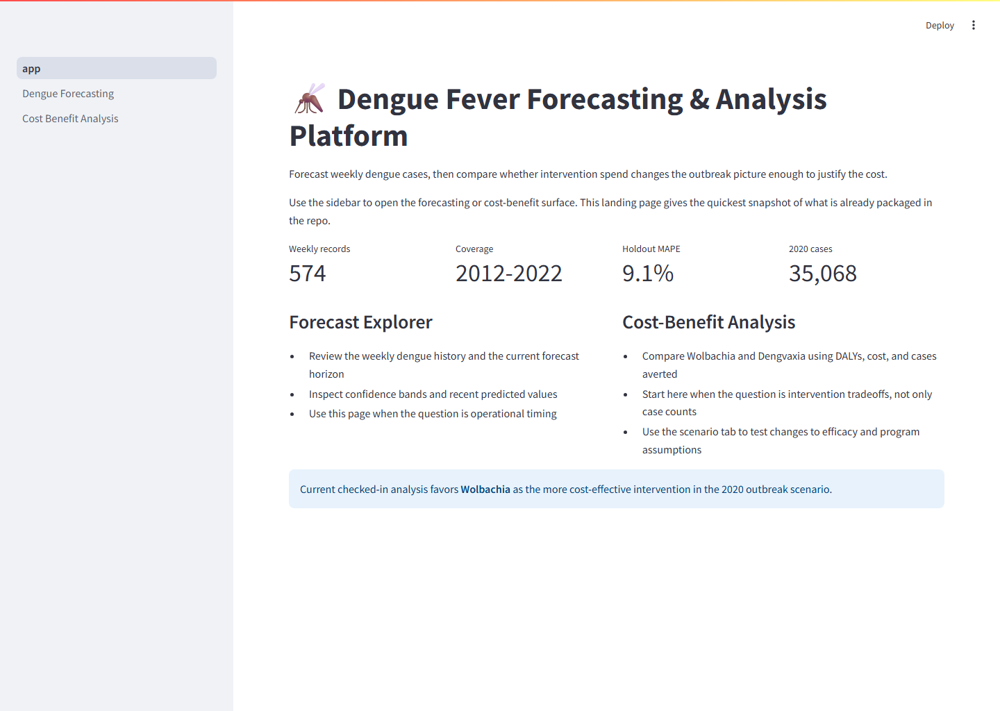

# Dengue Case Prediction and Cost-Benefits Analysis Platform

A file-based Singapore dengue decision-support app: weekly outbreak forecasting plus Wolbachia vs. Dengvaxia cost-benefit analysis, surfaced in Streamlit and backed by one research notebook.

Built around four local inputs: dengue surveillance, weather, Google Trends, and population CSVs.

<!-- README_SURFACE_START -->


[](https://adredes-weslee.github.io/epidemiology/forecasting/health-economics/2025/06/18/forecasting-dengue-cases-and-cost-benefit-analysis.html) [](https://adredes-weslee-dengue-case-prediction-and-c-dashboardapp-aszwww.streamlit.app/)

  

## Interface Preview



## Quickstart

```bash
pip install -r requirements.txt
python scripts/run_preprocessing.py
streamlit run dashboard/app.py
```

See [Setup and Run](#setup-and-run) for the full environment and verification path.

<!-- README_SURFACE_END -->

## Why This Repository Exists

- Forecast weekly dengue cases up to 16 weeks ahead so public-health teams can plan response earlier.
- Compare intervention options for the 2020 outbreak using DALYs, program costs, and scenario modeling.

## Architecture at a Glance

- `src/config.py` centralizes paths/constants for `data/raw`, `data/processed`, and `data/output`; the shipped outputs are `forecasting_model.pkl`, `predictions.csv`, `forecasting_model_metrics.json`, and `cost_benefit_analysis.json`.
- `src/data_processing.py` loads the four raw CSVs, normalizes them to weekly Monday dates, left-merges them into `dengue_master_timeseries.csv`, and fills gaps with `ffill/bfill`.
- `src/model_pipeline.py` trains one Prophet model, evaluates a 16-week holdout, and saves the model plus metrics; `scripts/forecasting.py` reloads that model to write `predictions.csv`.
- `scripts/run_analysis.py` reads the processed CSV, filters 2020, and writes the cost-benefit JSON; `dashboard/app.py` plus `dashboard/pages/*.py` provide the Streamlit UI.
- The notebook contains the original research workflow and baseline-model comparisons, but those baselines are not in the runtime `src/` code path.

## Repository Layout

- `dashboard/`
- `data/`
- `notebooks/`
- `scripts/`
- `src/`
- `.gitignore`
- `environment.yaml`
- `README.md`
- `requirements.txt`

## Setup and Run

1. Use `pip install -r requirements.txt` for the app, or `conda env create -f environment.yaml` for the fuller research environment; the conda file pins Python 3.11.0 while the README badge says 3.9+.
2. The runtime app depends on a small set of packages, while `environment.yaml` adds the heavier notebook stack (`matplotlib`, `scikit-learn`, `statsmodels`, `jupyter`, `openpyxl`, `cmdstanpy`).
3. Recommended run order: `python scripts/run_preprocessing.py`, `python scripts/run_training.py`, `python scripts/forecasting.py`, `python scripts/run_analysis.py`, then `streamlit run dashboard/app.py` or `python scripts/run_dashboard.py`.
4. `scripts/run_analysis.py` is not an orchestrator; it assumes the processed CSV already exists.

## Core Workflows

- Preprocessing converts the raw weekly and daily/monthly sources into one weekly master table.
- Training creates the Prophet model, saves the pickle and metrics JSON, and forecasting generates the future CSV.
- The forecasting dashboard page lets users change horizon and intervention scenario; the cost-benefit page shows the 2020 analysis and a separate what-if model.
- The dashboard pages are gated on local artifacts, so they expect preprocessing, training, and analysis to have been run first.

## Known Limitations

- Some older documentation still refers to `prophet_model.pkl`, but the code uses `forecasting_model.pkl`.
- The checked-in `scripts/run_analysis.py` entrypoint only runs the cost-benefit step, not the full forecasting and intervention pipeline.
- `src/data_processing.py` can fall back to synthetic Google Trends or population series if parsing fails; the current cost-benefit output reflects an estimated population baseline, not the config constant.
- Cost-effectiveness thresholds disagree across code paths: `src/cost_benefit_analysis.py` hard-codes `1800`, while `dashboard/pages/2_Cost_Benefit_Analysis.py` uses `30364`, `82703`, and `166255` bands.
- There is no `LICENSE`, `tests/`, `.github/`, or Dockerfile in the repo, so avoid implying production or deployment maturity.
- If you cite MAPE, distinguish in-sample vs holdout; `data/output/forecasting_model_metrics.json` records both.
- Baseline model comparisons live in the notebook, not the maintained runtime pipeline.
